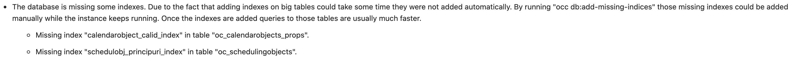
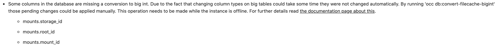
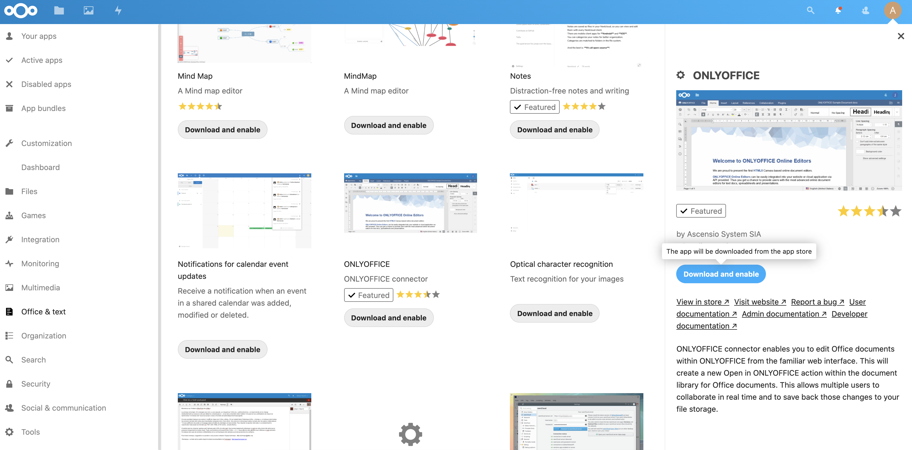
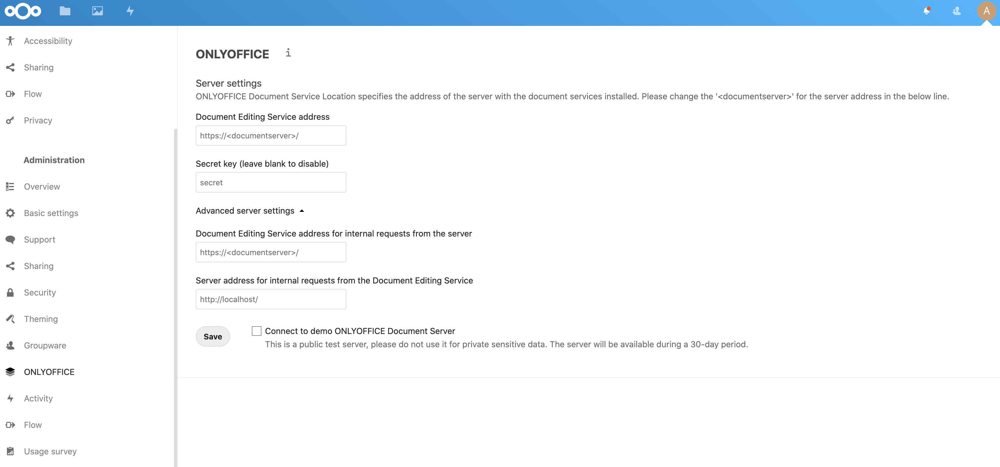
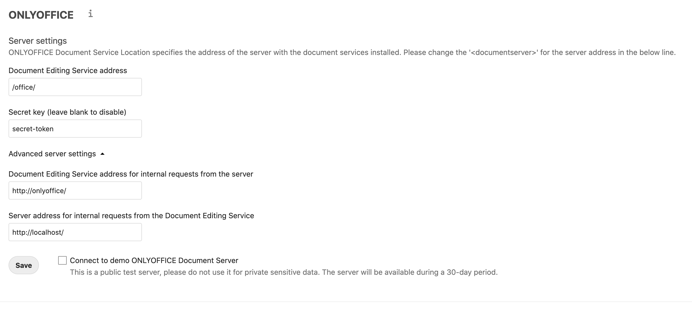

# Nextcloud Dockerized
- [Nextcloud Dockerized](#nextcloud-dockerized)
  - [Overview](#overview)
  - [Requirements](#requirements)
  - [Installation](#installation)
  - [Environment Variables](#environment-variables)
  - [Advanced Topics](#advanced-topics)
    - [System Cron Job](#system-cron-job)
    - [Nextcloud Warnings](#nextcloud-warnings)
      - [Add Missing Indices](#add-missing-indices)
      - [Convert Filecache Bigint](#convert-filecache-bigint)
    - [Connect OnlyOffice](#connect-onlyoffice)
    - [Preview Generator](#preview-generator)
    - [Setup Draw.io](#setup-drawio)
  - [Resources](#resources)

---

## Overview

Current Nextcloud Version: 20

This repository contains a template to deploy [Nextcloud](https://nextcloud.com/) using [Docker Compose](https://docs.docker.com/compose/) on a single machine running [Docker](https://www.docker.com/).

## Requirements

- [Docker](https://www.docker.com/)
- [Docker Compose](https://docs.docker.com/compose/)
- [Git](https://git-scm.com/)
- Text editor of your choice (e.g. [Vim](https://www.vim.org/))

## Installation

Clone the repository:

```sh
$ git clone https://github.com/cedrichopf/nextcloud-dockerized.git
Cloning into 'nextcloud-dockerized'...
```

Create a copy of the example configuration files:

```sh
# Nextcloud Configuration
$ cp example.env .env
# Custom Docker Compose Configuration
$ cp override.example.yml docker-compose.override.yml
# Redis Configuration
$ cp config/redis.example.conf config/redis.conf
```

Configure the Nextcloud deployment by adapting the environment variables in the `.env` file:

```sh
$ vim nextcloud.env
```

Further information about the available environment variables can be found here: [Environment Variables](#environment-variables)

Configure the docker-compose.override.yml file:

```sh
$ vim docker-compose.override.yml
```

**Important:** The example configuration doesn't publish any ports by default. It uses an existing [Traefik](https://containo.us/traefik/) instance as a reverse proxy to access the Nextcloud instance. If you want to publish ports, please add them to the `docker-compose.override.yml` configuration.

Download the Docker images and start the services using docker-compose:

```sh
$ docker-compose pull
$ docker-compose up -d
```

Open your browser and access your Nextcloud instance using the URL of the Docker host, e.g. [http://127.0.0.1](http://127.0.0.1).

## Environment Variables

The following table contains an overview of the environment variables which can be configured in the `nextcloud.env` file.

| Environment Variable | Example            | Description                           |
| -------------------- | ------------------ | ------------------------------------- |
| COMPOSE_PROJECT_NAME | `nextcloud`        | Project name for docker-compose       |
| MYSQL_ROOT_PASSWORD  | `hmjGVBufBVsCy8Ut` | Root password of the MariaDB database |
| MYSQL_USER           | `nextcloud`        | Username of the database user         |
| MYSQL_PASSWORD       | `s5xwMGLPh2qfDEVu` | Password of the database user         |
| JWT_ENABLED          | `true / false`     | Enable JWT Auth for OnlyOffice        |
| JWT_SECRET           | `qxd79yG4bGh2mn9w` | JWT Secret to connect to OnlyOffice   |

## Advanced Topics

This section contains information about advanced configuration options of an installed Nextcloud instance.

### System Cron Job

Using a system Cron job to run the `cron.php` file can improve the performance of your Nextcloud instance a lot. Since Nextcloud and all its dependencies are running inside Docker containers, you need to add a Cron job which is executing the `cron.php` file inside the container. This can be done by adding the following line as a system Cron job:

```sh
$ crontab -e
# Add the following line to the crontab, don't forget to adapt the container name
*/5 * * * * /usr/bin/docker exec --user www-data <container_name> /usr/local/bin/php /var/www/html/cron.php
```

### Nextcloud Warnings

The following warnings of your Nextcloud instance can be fixed by using the provided scripts.

**Important:** The scripts are using docker-compose to run the maintenance tasks in your Nextcloud container. Therefore, it is important to run the scripts in the same folder as the `docker-compose.yml` file.

#### Add Missing Indices



```sh
# Run the command next to the docker-compose.yml file
$ ./scripts/add-missing-indicies.sh
Check indices of the share table.
Check indices of the filecache table.
Check indices of the twofactor_providers table.
Check indices of the login_flow_v2 table.
Check indices of the whats_new table.
Check indices of the cards table.
Check indices of the cards_properties table.
Check indices of the calendarobjects_props table.
Adding calendarobject_calid_index index to the calendarobjects_props table, this can take some time...
calendarobjects_props table updated successfully.
Check indices of the schedulingobjects table.
Adding schedulobj_principuri_index index to the schedulingobjects table, this can take some time...
schedulingobjects table updated successfully.
```

#### Convert Filecache Bigint



```sh
# Run the command next to the docker-compose.yml file
$ ./scripts/convert-filecache-bigint.sh
Following columns will be updated:

* mounts.storage_id
* mounts.root_id
* mounts.mount_id

This can take up to hours, depending on the number of files in your instance!
Continue with the conversion (y/n)? [n] y
```

### Connect OnlyOffice

Once the installation of Nextcloud is done, the OnlyOffice instance, which has been already started using `docker-compose up -d`, can be connected to Nextcloud.

First, install the OnlyOffice application from the Nextcloud App Store:



Switch to the administration panel and open the settings for the OnlyOffice application:



Configure the application to connect to the running OnlyOffice Document Server instance:



| Parameter                   | Example                                                  | Description                   |
| --------------------------- | -------------------------------------------------------- | ----------------------------- |
| Document Service            | /office/                                                 | Path to OnlyOffice            |
| Secret key                  | secret-token                                             | JWT Token from `.env` file    |
| Document Service (internal) | [http://onlyoffice/](http://onlyoffice/)                 | Internal URL to OnlyOffice    |
| Server address (internal    | [https://cloud.example.com/](https://cloud.example.com/) | URL of the Nextcloud instance |

**Important:** The configuration of OnlyOffice depends on the system environment. The example configuration above has been tested with this Nextcloud deployment running behind a [Traefik](https://containo.us/traefik/) instance which is also handling the requests for OnlyOffice. Please have a look at the [override.example.yml](override.example.yml) for more information about the [Traefik](https://containo.us/traefik/) configuration.

Finally, verify the configuration is working by creating and opening a new document using the Nextcloud Web-UI.

### Preview Generator

*Coming soon...*

### Setup Draw.io

*Coming soon...*

## Resources

- [Nextcloud](https://nextcloud.com/)
- [Docker](https://www.docker.com/)
- [Docker Compose](https://docs.docker.com/compose/)
